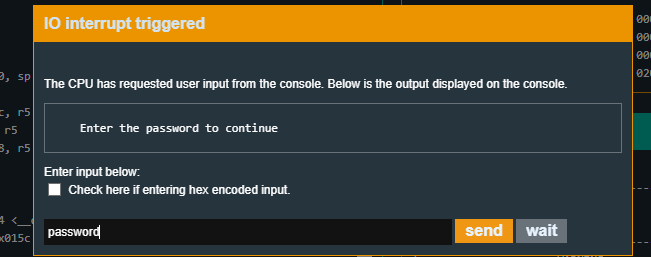
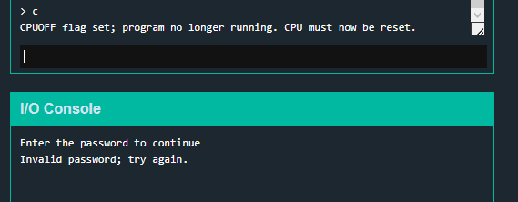
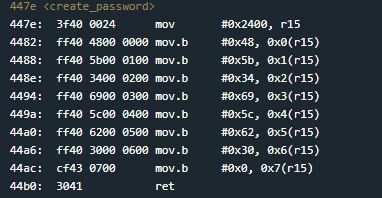
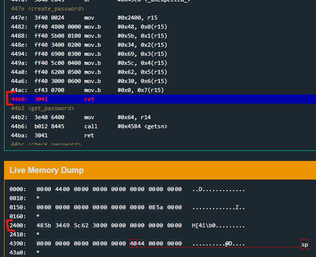
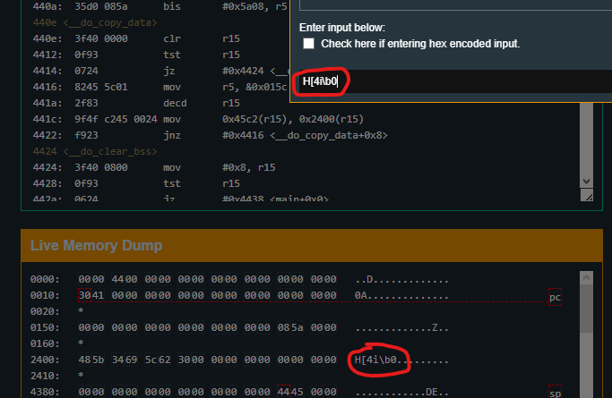
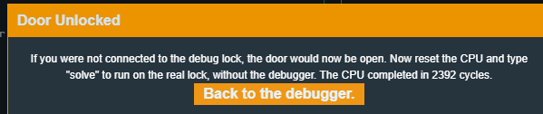

# New Orleans

New Orleans is the first challenge after the tutorial.
It is revision 01 of the lock with no hardware security module attached.

The first thing I like to look at is the disassembly of main. Just to get a feel for what this program might want to do when it's run.
Without reading the assembly and just skimming over the plaintext strings and function names we can already get a decent idea of what this program does.
This does assume that the function names actually do what they say, but since this is meant to replicate legitimate software and not some obfuscated malware, I don't think it's
too wrong to start with that assumption.

1. Before anything else, create a password. Probably the lock password.
2. From the string "Enter the password to continue" and the get_password call we can assume the program gets some user input which will be used as the password
3. check_password then executes and probably checks whatever was given in get_password by the user against what was set by create_password in step 1
4. test r15, which is probably the function return variable (like eax or rax) which would contain the result of whether the passwords matched
5. jump to the password valid code or execute the password invalid code depending on whether the password is right or wrong.
6. call unlock_door if password was right

Seems simple enough as long as those assumptions are true.
My initial thoughts for possible exploitation after reading that main disassembly are:

- check create password to see if the created password is static/guessable/reversable in some way
- check get_password for a buffer overflow in the user input
- check check_password for a logic flaw in the password comparison 

The first one is likely the easiest so i'll go with that check first, but before I do i'll test the program to make sure it's executing roughly the way I think it should be.

if I run the program and enter an invalid password

and then continue past the automatically set breakpoint

I get the invalid password output and the lock doesn't open, which sucks but it's executing as I expected.

So now I want to check out the create_password function in case there is a real quick win with a static password. 
Which i'm kind of expecting since it is the first challenge after the tutorial.

A quick breakdown of this disassembly goes like this:

1. we move the hex number 2400 into r15 (this asm goes <op> <source> <dest>)
2. the next seven instruction move one byte (mov.b) of a hardcoded hex value into the address pointed to by the value in r15 (2400)
3. after those hex bytes have been set in that memory address we return

So that means create_password is setting a 7 character hardcoded password in 0x2400 in memory which the program can then reference later to check if the user entered password is correct.

If I set a breakpoint on the ret in create_password and look at 0x2400 in the live memory dump, I can see that the hardcoded string is indeed set where I expect

Looking into the check_password function I can also see that 0x2400 is used in a loop that compares bytes against whatever is referenced by r13. 
Which is likely the user inputted password.

This is enough to make a first pass at solving this challenge. I can just try inputting the hardcoded string as a password.
Since the hardcoded string hex characters all resolve to valid ascii characters, I can just copy paste the string from memory and paste it in as ASCII input

And that worked.

The last thing to do is input the password into the real lock and win

