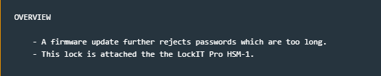
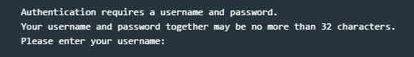
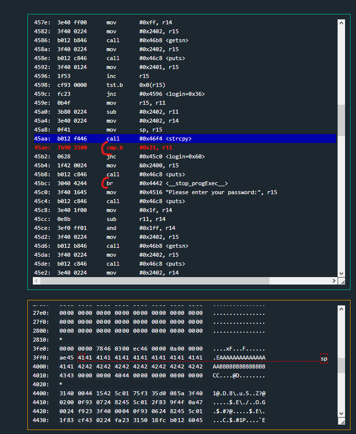
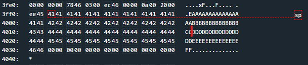
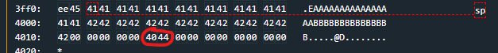
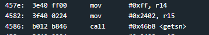
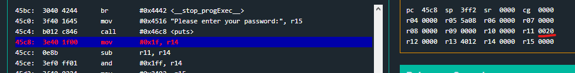
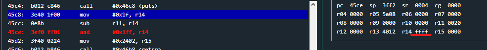
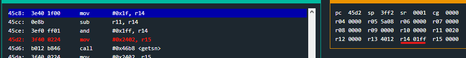
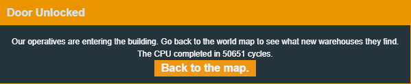

# Jakarta

Jakarta is the 10th challenge in the microcorruption series.
This challenges change notes are much the same as the last challenge. 
Overly long passwords are rejected and the lock is still attached  to the HSM-1



When running the program the new rules are displayed. The username and password combined cannot be more than 32 characters.



This can be confirmed by looking at the login function, where a few extra lines of code have been added after the username and password strcopys which check the length against
the hardcoded value of 0x21 (decimal 33)

After each username and password entry, the current length of the username and password combined are checked against the hardcoded 0x21 value



The password, once entered is added onto the end of wherever the username ends. It does not overwrite the username after say 16 characters.
This means that if you have a 20 characters username, the passwords length is now limited to 12 characters.



Since my test input that I entered were both 32 characters each, I passed the first test (username) and failed the second test (password)

This new control forces the combined username and password length to be unable to reach the return address (which is circled in the below picture)
Preventing the buffer overflow in the previous challenge.



this new control stumped me so I spent some time stepping through the login function to verify it was doing what I expected.
Here is my commented outline of what login() is doing.

```assembly
4560: push	r11
4562: add	#0xffde, sp

; Print stuff
4566: mov	#0x4482 "Authentication requires a username and password.", r15
456a: call	#0x46c8 <puts>
456e: mov	#0x44b3 "Your username and password together may be no more than 32 characters.", r15
4572: call	#0x46c8 <puts>
4576: mov	#0x44fa "Please enter your username:", r15
457a: call	#0x46c8 <puts>

; Get username
457e: mov	#0xff, r14
4582: mov	#0x2402, r15
4586: call	#0x46b8 <getsn>
458a: mov	#0x2402, r15
458e: call	#0x46c8 <puts>

; find address for the end of the username string
4592: mov	#0x2401, r15 ; 1 byte before username buffer
4596: inc	r15  ; increment counter
4598: tst.b	0x0(r15) ; Test if we are at the end of the username string 
459c: jnz	#0x4596 <login+0x36> ; jump back to inc r15

; sub end address of username from start address of username to get username length
459e: mov	r15, r11
45a0: sub	#0x2402, r11

; setup strcpy args and then copy username to the stack
45a4: mov	#0x2402, r14
45a8: mov	sp, r15
45aa: call	#0x46f4 <strcpy>

; end program if username length is >= 0x21 characters long
; otherwise jump to 45c0 
45ae: cmp.b	#0x21, r11
45b2: jnc	#0x45c0 <login+0x60>
45b4: mov	&0x2400, r15
45b8: call	#0x46c8 <puts>
45bc: br	#0x4442 <__stop_progExec__>

; get the password input
45c0: mov	#0x4516 "Please enter your password:", r15
45c4: call	#0x46c8 <puts>
45c8: mov	#0x1f, r14
45cc: sub	r11, r14
45ce: and	#0x1ff, r14
45d2: mov	#0x2402, r15
45d6: call	#0x46b8 <getsn>
45da: mov	#0x2402, r15
45de: call	#0x46c8 <puts>
45e2: mov	#0x2402, r14
45e6: mov	sp, r15

; strcopy password after username on the stack 
45e8: add	r11, r15 ;r11 contains username length 
45ea: call	#0x46f4 <strcpy>

; find end address for end of password 
45ee: mov	#0x2401, r15
45f2: inc	r15
45f4: tst.b	0x0(r15)
45f8: jnz	#0x45f2 <login+0x92>

; calculate password  length 
45fa: sub	#0x2402, r15
; add password length to username length 
45fe: add	r11, r15
; check if total length is >= 0x21 and exit if it is 
4600: cmp.b	#0x21, r15
4604: jnc	#0x4612 <login+0xb2>
4606: mov	&0x2400, r15
460a: call	#0x46c8 <puts>
460e: br	#0x4442 <__stop_progExec__>

; hsm-1 call 
4612: mov	sp, r15
4614: call	#0x4458 <test_username_and_password_valid>

; test hsm result flag
4618: tst	r15

; jump past the unlock_door() func if the password was wrong
461a: jz	#0x4626 <login+0xc6>
461c: call	#0x444c <unlock_door>
4620: mov	#0x4532 "Access granted.", r15
4624: jmp	#0x462a <login+0xca>
4626: mov	#0x4542 "That password is not correct.", r15
462a: call	#0x46c8 <puts>
462e: add	#0x22, sp
4632: pop	r11
4634: ret

```

Stepping through that function, as well as the strcpy and HSM-1 interrupt functions did not make anything immediately pop out as vulnerable to me though.


Ok i've looked at this for along time and got nowhere so i'll start document the flaws I have found. Maybe it will click with me along the way.


## The username field accepts to many characters



getsn takes two arguments, the length of the string and the memory address to store it.
The username getsn length should likely be something like 0x1f (decimal 31) to comply with the 32 length limit.
However, the supplied length is 0xff (decimal 255), allowing up to 255 characters to be entered.
This will overflow the stack and corrupt the return address, however the immediate check of the username length after the strcpy prevents a username longer than 32 characters from working.

## The password length can be manipulated by the username field

The password getsn() argument uses the correct 0x1f length instead of 0xff that the username field used.
However! there is a teenie math error that lets the password length be expanded alot.
The username allows 32 characters to successfully be entered, and the password length is calculated like this 31 - len(username).

This usually works, for example, a 6 character password would be 31 - 6 which would leave 25 characters for the password.
This would prevent more than 25 characters in the password field from being input and prevent overflows.

However a username that uses all 32 characters leads to this logic 31 - 32.
This causes an underflow  and sets the password length to 0xffff

This can be seen in the following examples. Here I have entered a 32 character username, the length of which is stored in r11 (0x20 == decimal 32)
0x1f (31) is moved into r14 and then the two are subtracted.



After the subtraction (32 - 31), the r14 register underflows to 0xffff, giving a password length of 65,535


this is slightly dampened by the proceeding logical AND, which reduces the valid length down to 0x1FF (or 511 decimal)



Unfortunately, immediately after I enter an overly long password with this trick (that does overwrite the return address), the combined password + username length check is conducted and I fail it.

-------------------

Actually! it doesn't need to fail!

There is a third flaw that will bypass the username + password length check

When I set an overly long password (maxed out with 511 characters), the resulting addition of the 32 character username and the long password is 0x021f.

When you look at that number as a whole, it is obviously larger than 0x21.

But the comparison doesnt check the whole register! it checks one byte!
And the last byte of our number is x1f (31 decimal), which is smaller than 0x21 and therefore passes the check!


breaking at the return at the end of the login() function then stepping once gives me the glorious overwrite of the PC register.


After which its a simple redirect to the unlock_door() function like usual with the hsm-1 and that is a solve.

