# Addis Ababa 

Addis Ababa is the 11th challenge in the microcorruption series.
This challenge has quite a significant change in the change notes.
For the first time there is mention of usernames being printed back to the user for verification

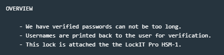

Scrolling through the program, login() has dissapeared and the meat of the code now reside back within main()
Of note, there are several calls to printf(), which in previous challenges, would have been puts() calls.

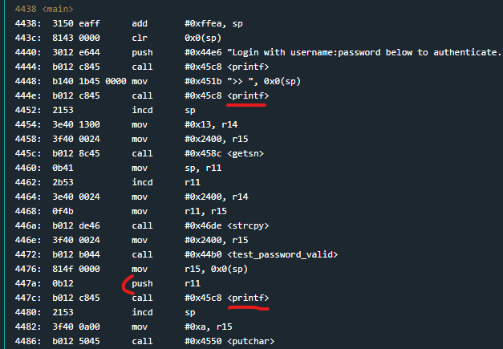

My first thought, considering the change notes stating that usernames will be presented back to the user and there are now printf calls is to check for a format string vulnerability.

So I start off with a few %x's to check if some memory gets leaked in hex format.

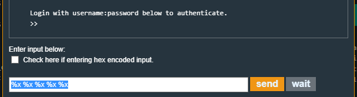

Sure enough, some memory is leaked back to me in the output console.
 
 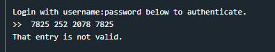

 and converting this back to ascii shows it's just the %x's that I entered.

 

 Ok cool. So as a next step I want to confirm that I can write to memory with this vuln.
 To do that i'll generate a payload of a few letters followed by a few %x's to see if the %x's point to the previous letters.

 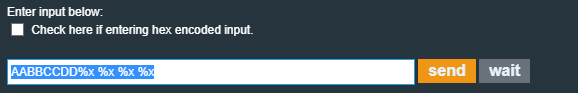

 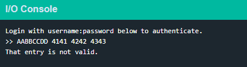

 So the first %x immediately starts leaking out the initial A's amd the next %x leaks out the B's and so on.
 This means if I change the second %x to a %n I should write to memory at 0x4242.
 So i'll try that next.

 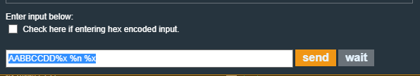

 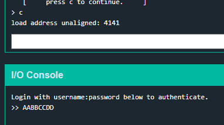

 The second %x results in an unaligned error in reference to 0x4141.
 I want to modify the B's though, which means I probably need to be modifying the next %x along, so i'll try again with the 3rd %x as a %n to try and modify the address 0x4242

 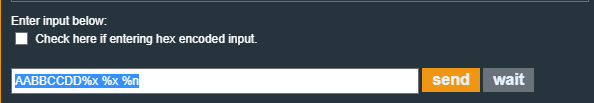

 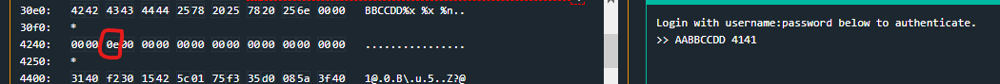

 Cool, 0x4242 was overwritten with 0x0e. I can write to arbitrary memory addresses.
 Now I need to find something that I care to overwrite.

 The change logs noted that this lock is still connected to the HSM-1, meaning that after the password is tested the HSM will set a flag in memory to determine if the password was correct or not.
 If I can modify that memory address to change the flag I was make the program think I got the password correct.

 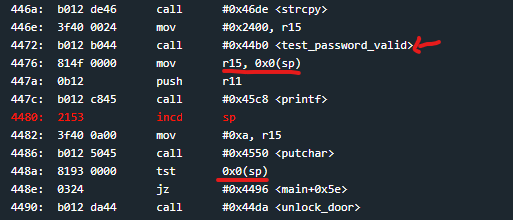

 In main() after the test_password_valid() call, the result flag is moved to sp(0x0), or the current address of the stack pointer, which is then tested (tst 0x0(sp)) later to see if the password was correct.
 The vulnerable printf sits in the middle of those two lines of code, so I should be able to overwrite the flag at 0x0(sp) to something that isnt zero so the program thinks I entered the right password.

 Thankfully, these locks don't have ASLR or anything that will shift the stack address on different executions, so I should be able to just grab the address of flag and hardcode it into the payload.

 Breaking at the test command I can see that the SP register points to 30dc at this step, so I will overwrite that address which should overwrite the flag.

First i'll convert my payload to a hex equivalent, since I need to enter a hex address.

AABBCCDD%x %x %n %x
will become
41 41 42 42 43 43 44 44 25 78 20 25 78 20 25 6e 20 25 78

I'll then replace the 0x42's with the 0x30dc memory address.

41 41 dc 30 43 43 44 44 25 78 20 25 78 20 25 6e 20 25 78

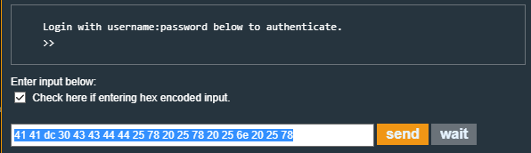

If i break before the printf, the flag location is still 0x00 (because the password was wrong)

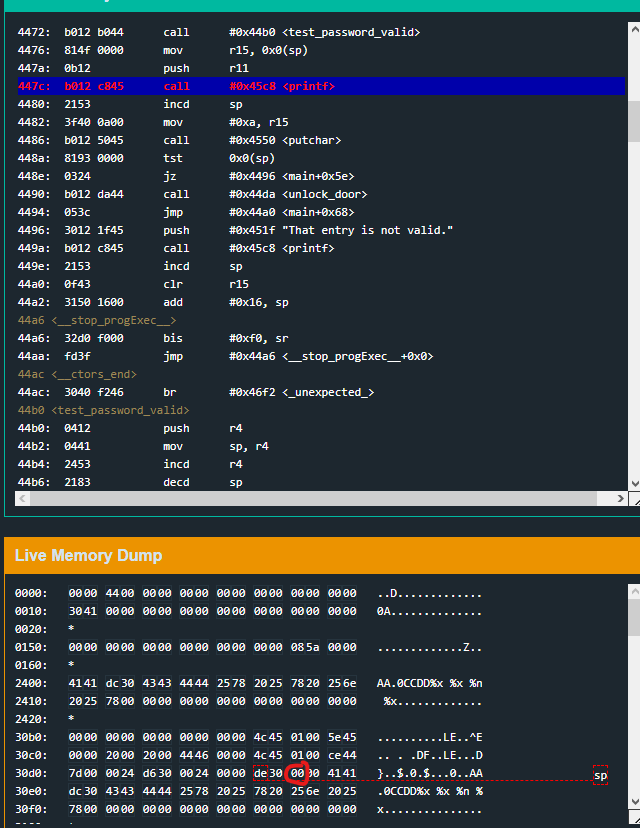

Breaking again after the printf reveals that the flag has been modified and the flag test will now pass, unlocking the door

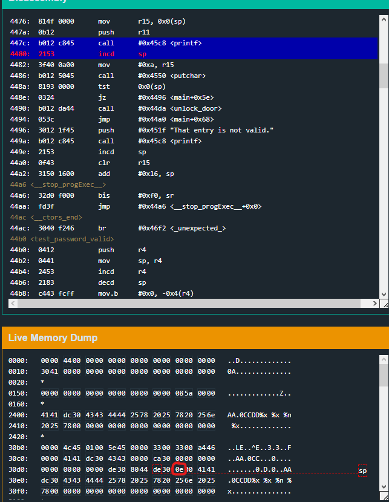

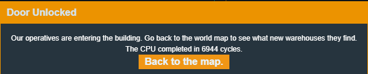