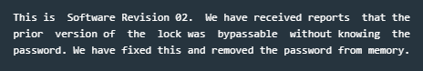
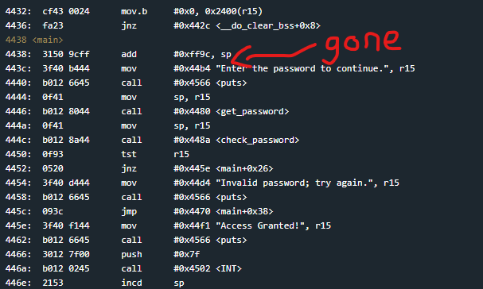
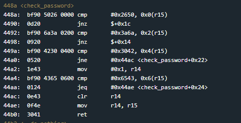
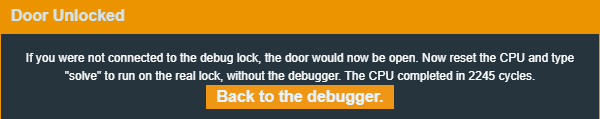

# Sydney

Sydney is the second challenge (excluding the tutorial) on Microcorruption.
The Manual tells me that it is Software Revision 02, which is addressing plain text passwords in memory, which have now been removed.

If I check the main disassembly I can indeed see that the create_password function from before has been removed.
Everything else looks fairly untouched though (in the main function that is).

The check_password function is still called though and since there is no hardware security module still, it must be checking something that I can see/reverse right?

Ok so a quick breakdown of this function:

1. It starts with the comparison checks, jumping towards the end of the function if any of them fail
2. Those checks compare a hardcoded 2 byte hex string against an incrementing 2 bytes in r15.
3. If those checks all pass, move the value 1 into r14, which is then moved into r15 before returning
4. We then check 2 more bytes against the next increment in r15
5. if any of those checks fail we clear r14 and move it to r15 which gets returned

So I can assume that r15 is the user password and the 2 byte cmp's are checking r15 against a hardcoded value. It's just not in memory this time.

let's grab those values and pass them in as hex. I'll have to swap around the 2 byte chunks because little endian is a thing, but other than that its a simple copy paste job.

and it was that simple.

