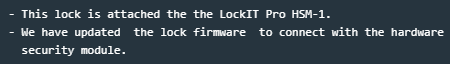
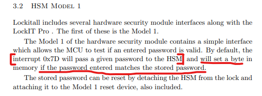
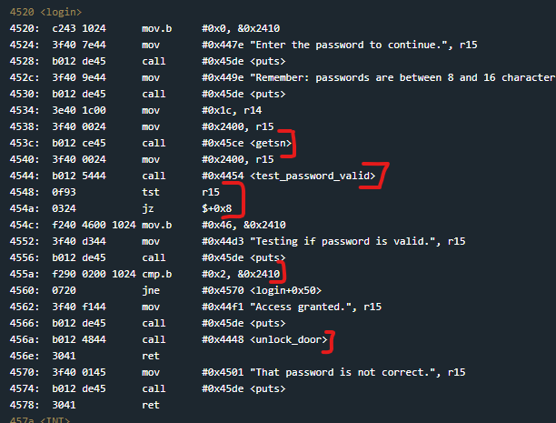
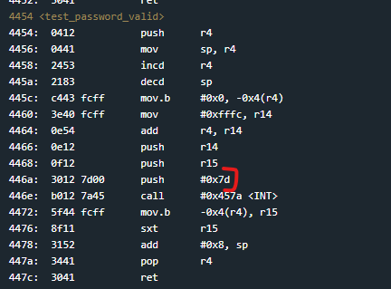
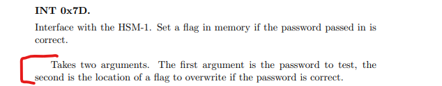
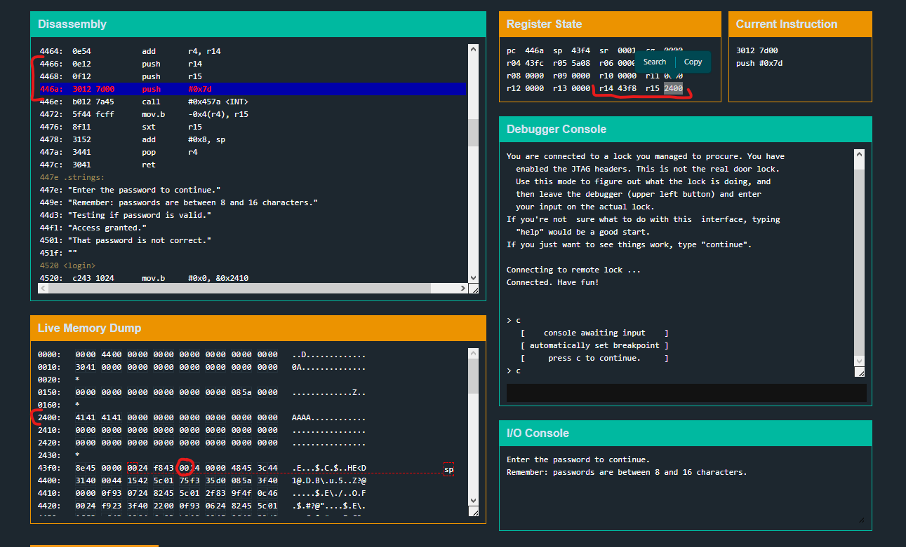

# Hanoi

Hanoi is the 3rd Microcorruption challenge and the first challenge to implement a HSM connection for the lock.

The Hardware Security Module (HSM) is a new addition to the lock so I took the time to look at the lock manual and see what the HSM actually does.
Essentially it gives the lock code the ability to trigger an interrupt (0x7D) which will prompt the HSM to set a byte in memory if the input password is correct.
The idea being that you cannot see or touch the HSM code to exploit passwords in memory and/or logic bugs in the password comparison function

Once again i'll start with main to see how the main code execution logic has changed or stayed the same.

The main() flow now looks like this:

- Get user password
- call test_password_valid
- do some comparisons
- call unlock_door if the passwords match

It's essentially still the same main function as the last challenge, except instead of check_password, the code now calls test_password_valid.
So my next step is to check what that function does, since that is where I'm expecting the major change to occur. 

The test_password_valid function sets some stuff up and then performs an interrupt with the interrupt code 0x7d, which is the HSM 1 interrupt code from before.
It then moves a value to r15 and returns. From the documentation I can reasonably assume that r15 will contain the byte value that the HSM sets if the password is correct.
Now I want to check out what the two other pushes before the interrupt are for (the push r14 and push r15).

The lock manual lets me know that the HSM 1 interrupt takes two args. The first (push r15) will contain the address of the password I entered. The second (push r14) will contain the location in memory where the HSM should set the result flag to let the lock know if the password is correct.
Time to confirm this with some breakpoints at the INT call.

I've paused at 446a, just after the arguments are pushed to the stack, but just before the HSM call.
r14 and r15 contain the result flag address and password memory location respectively and this can be confirmed in the live memory dump.
0x2400 in r15 contains 41414141, which is the password I entered (AAAA) and 0x43f8 refers to a currently zeroed address on the stack.
If I step past the Interrupt call I probably won't see 0x43f8 change (as it's likely that 00 indicates incorrect password), but I should see it being used as the return value.

Sure enough, right after the interrupt, the byte at r4-0x4 is moved to r15. From the register state on the right I can see that r4 is 0x43fc, which if I minus 0x4 is 0x43f8 (the address of the result flag).

Looking back at the main function disassembly above, this 

