# Cusco

Cusco is the 4th Microcorruption challenge and I am presented with change notes that indicate that passwords which are too long that overwrite a conditional
flag have now been fixed. The lock is once again attached to the HSM-1, meaning the password and its confirmation logic are not in memory.

![changes])(Images/Cusco/CUS-changes.png)

First things first, how does the program look?

main still just calls login()

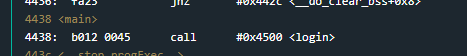

And login still does the meat of the operations by getting the user password, validating it and then calling unlock_door() if the password is correct.

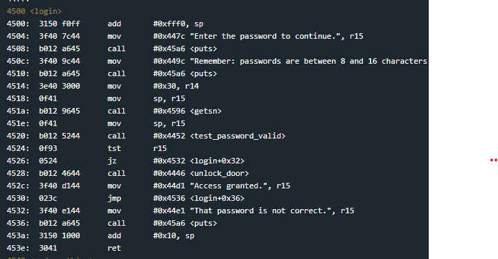

Notably (and as the patch notes indicate) there is no longer a conditional flag check conducted before unlock_door() which can be abused.
However, if that is the "fix" then the overly long password issue might still be an issue.

I can't really see much to attack inside this function anymore. The only conditional statement which could be manipulated is one that is set by the HSM and immediately tested before it can be interfered with.

However, the unlock_door() function still sits within our address space and not within the HSM (this is the major difference between the HSM 1 and HSM 2).
So if I can jump to that function the lock will still open.

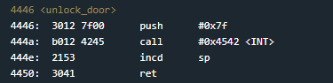

Ok so first thing is to check if PC (eip/rip) can be overwritten. 

I'll document why the program counter is overwritable as I go.

So the main chunk of execution happens in login(), but before that we have main(), which the program will eventually return to.
So as main() calls the login() function, it will push PC to the stack, so it can be popped off at the end of the login() function and code execution can continue.
This is the same for x86/x64 programs.

Here is the stack just before the call to login()

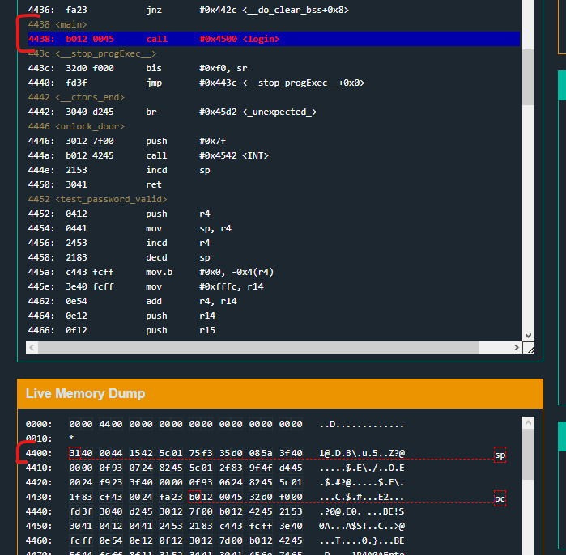

And here is the stack after

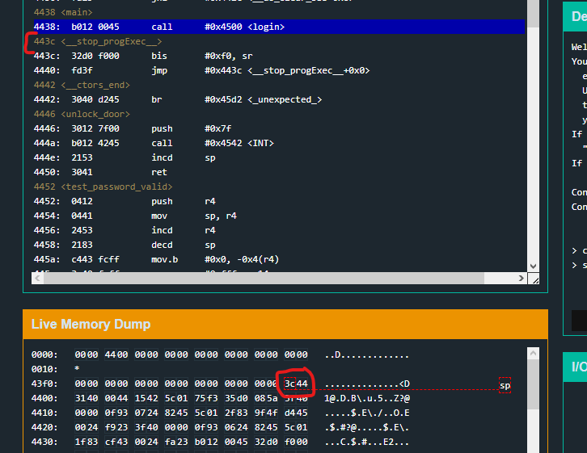

The next address to execute after the login call (0x443c __stop_prog_Exec__()) is pushed onto the stack.
The bytes are reversed due to little endian, but it is 0x443c.

The hope is that the entered password can overrun its buffer and continue on down to this address in memory. 
Once the login() function returns and that address is popped into the PC register, the PC register will be pointing into whatever memory space I decide.

Ok, so I'll just try a fairly long password and see what is overwritten.

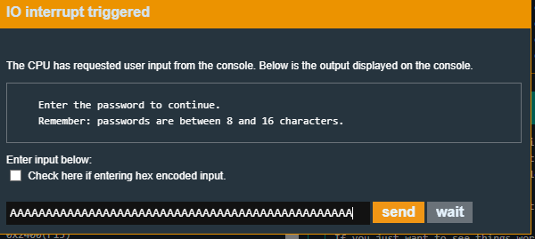

well ok then, that was a bit too long.
You can see in memory that the return address was overwritten fairly early on.
In fact, it was immediately after the 16 characters assigned for the password buffer.

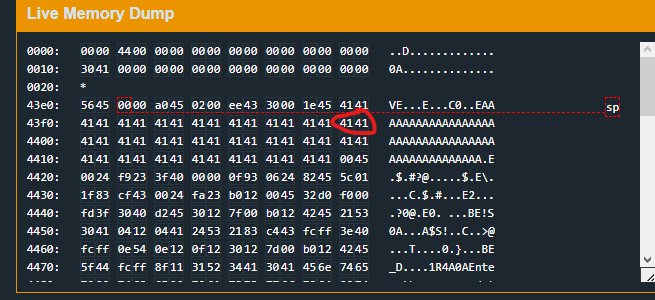

Ok so just to finish off the documentation, if I step over the return at the end of login, the "pop PC" instruction will occur in the background and the PC should become 4141.

Here is the PC register before the ret

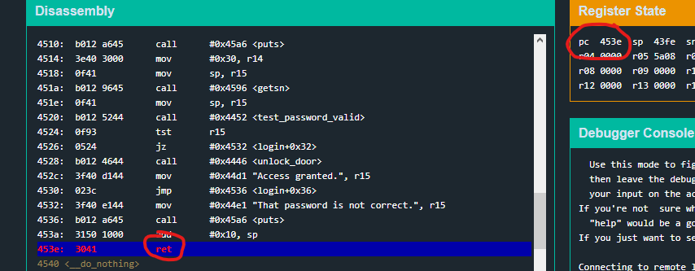

And here it is after the ret

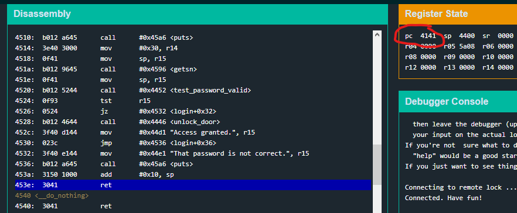

so I can control program execution after login() returns.
Since the overwrite occurs immediately after the password, I know it is bytes 17 and 18 that need to be overwritten.
So I can grab the address of the unlock_door() function and pass it into those bytes of the password (in little endian format).

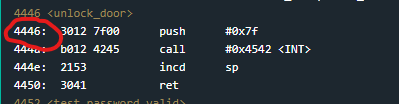

Since the address is 0x4446 and both 0x44 and 0x46 are both valid ascii characters, I can just pass in a regular ascii payload.

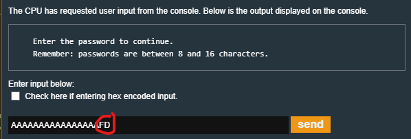

Success.

