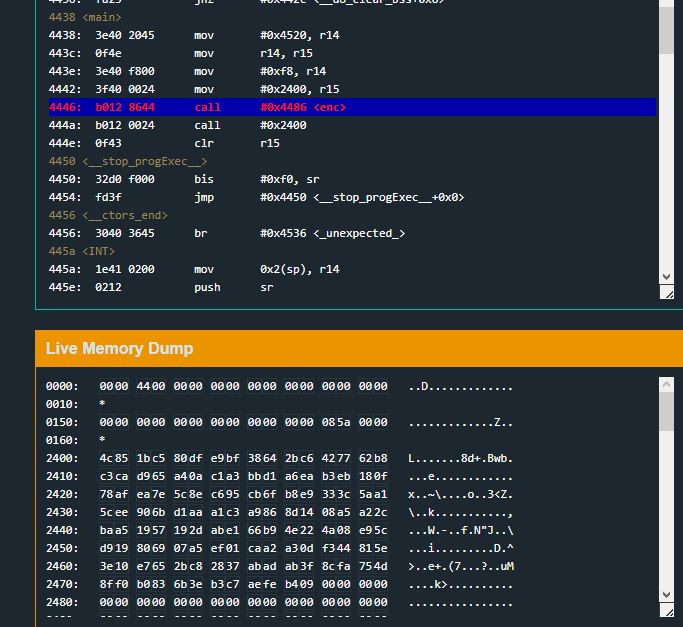
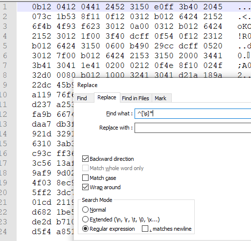
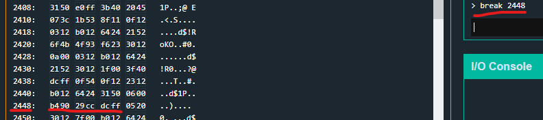
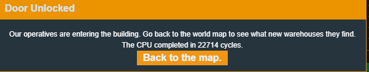

# Reykjavik

Reykjavik is the 5th challenge in the microcorruption series and the patch notes inform me that military grade encryption (lol) is now on the system.
As well as mention that the lock is no longer connected to a HSM. Cool, so the password might once again be in memory, we'll see.

So a quick skim over the disassembly reveals a few things:

- There is no longer a login() function. It all happens in main() now
- There is no unlock_door function(). which is very weird given there is no HSM attached
- There is a LARGE enc() function that is obviously doing some kind of encoding/decoding with xor (very military)
- MAIN CALLS A STATIC MEMORY ADDRESSS THAT DOESNT EXIST ON STARTUP

So one of those points obviously grabs my attention alot, why is main() calling a random memory address and then doing nothing else?
To make it more suspicious, it is called right after enc() and there is no other meaninful function in the program.

My hunch straight away is that enc doesnt encode/decode the password, but the program.
It is a well known method for things like PE injection, where at runtime you place and decrypt code for execution to evade detection and deter analysis.

The first thing I want to do is just break after the enc() call and see what appears at 0x2400

Here is the before:

ANNNND here is after:

Since the program then calls that memory address, its fair to assume this is assembly code.
Funnily enough, microcorruption comes with an assembler.
So I can take a paste of that memory dump..

and do some super duper basic cleanup with notepad++ (I'm sure there's a cooler easier way but oh well)

some regex to trim the memory addresses at the start of each line...

oops, and the multiple white spaces at the start of each line..

and remove the ending ascii display from each line..

Placing the result into the assembler and clicking disassemble gives what appears to be valid instructions

Alright, so now that it's executing the decrypted instructions at 0x2400 and not from programs .text section, I can't see the disassembly in the debugger screen anymore.
so  it's time to skim over the assembly and see if I can find some patterns or anything that jumps out.

The bottom sections of the disassembly appear to not be valid instructions. They might be still encrypted or garbage or whatever, so for now I can just focus on the top section of the disassembly.

Looking over the code shows a few things:

It can be broken down into two separate functions

The bottom function looks familiar (the bis 0x8000 followed by a call) and from memory it's the interrupt function so it can probably be ignored for now

The top function contains several calls to 0x2464 which are all preceeded by pushes to the stack, so i'm thinking 0x2464 is likely the interrupt function address.
Towards the end of the top function there is a very interesting 0x7f push followed by an interrupt.
Having already read a bunch of the doco from previous exercises I know that 7f is the "unlock lock" interrupt.

Looking juuuust before that unlock call there is a cmp followed by a jump, so it's a decent guess that the cmp is what needs to be "massaged".

the hardcoded value 0xcc29 is compared against whatever is in r4-0x24.
I'm thinking that R4-0x24 probably contains some portion of the password the user inputs. To confirm that I just need to break on that cmp instruction.
Which means looking at the bytes that represent the instructions we want to set the breakpoint at:

and finding them in memory at runtime to set a breakpoint there:

continuing on and entering a password will then let me break at that instruction like so

ok so now r4-0x24 should be pointing at something interesting...

r04 is currently pointing to 0x43fe

0x43fe - 0x24 is 0x43da

0x43da currently points to the start of the user inputted password.

soooo it looks like unlocking the lock might be as simple as making sure the password starts with 0xcc29 (or 29cc)

Might aswell give it a shot.

Success

