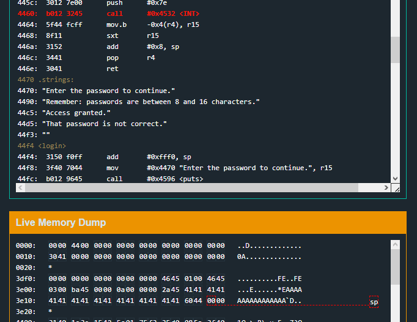
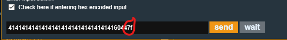
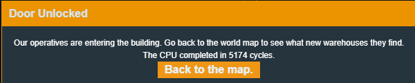

# Whitehorse

Whitehorse is the 6th challenge in the microcorruption series.
This time the HSM-2 is finally introduced, and the lock has also been updated to remove the local calls to the unlock function. 
Cool beans.

First thing, what is the HSM-2 and why is it different to the HSM-1?

Firsly, it is access via a different interrupt, and only takes one argument. Which is the password to test.
It no longer requires a memory location to set a flag.
This is due to...

The HSM-2 being more secure than the HSM-1 by triggering the unlock directly, rather than setting a potentially corruptable flag in user memory.
Which means no more fooling the program about the HSM return value.

ok so glancing over the program reveals that alot is still the same.
Main just calls login

Login does the normal, get password and print some stuff activity as well as calling conditional_unlock_door()

After the conditional_unlock_door call, there is still the usual "access granted" and "not correct" messages, but not the usual unlock_door() calls if the password is valid.
This is because the HSM-2 will handle the unlock call, which is probably called inside the conditional_unlock_door function. 
Next step is to check that out.

Sure enough, this function contains the HSM-2 call (0x7e) and is pretty simple and seemingly non exploitable.
Not much is going on, other than passing in the password and maybe the door unlocks, maybe it doesnt.

OK. so.

What's exploitable?

well, the program no longer has an unlock_door() function, and the HSM now handles calling the 0x7f (unlock door) interrupt for the program.
But there's nothing saying the program still cant call the 0x7f interrupt anyway.

but how?

well, here's the idea

- If a buffer overflow still exists, code execution can still be redirected to anywhere (including right at an interrupt call)
- interrupt calls take their args on the stack
- IFFF the buffer overflow is also used to write something like "7f" right before the jump to an interrupt. The interrupt SHOULD perform OUR interrupt instead of the intended one.

So. Time to check if the buffer overflow is still there.

Yep. Still exists.

And the return address overwrite is at byte 17. Right after the 16 character password 'limit'.
Ok so first step, redirect execution to an interrupt call.

Luckily, conditional_unlock_door() has just what i'm after. 
I can just redirect to the HSM-2 interrupt call.

So I am at the interrupt call and ready to go, but after the return address is popped, the stack moves back up 2 bytes and now points to the next byte after the return address, which is currently 00. The interrupt call will read from here to determine what type of interrupt to make. Usually it would be the 0x7e HSM-2 interrupt that the program pushes, but if I put my own 7f in that byte it should call the unlock_door function.

Continuing with program execution, I arrive at an interrupt call with 0x7f as the interrupt value.

Success

