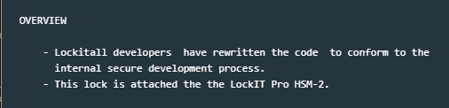
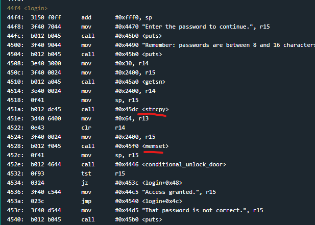
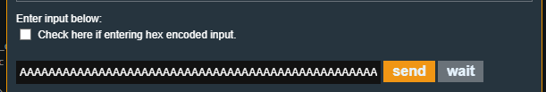
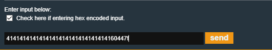
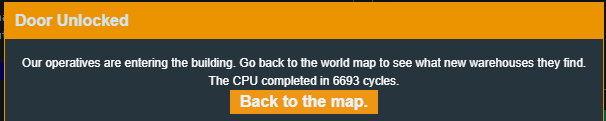

# Montevideo

Montevideo is the 7th challenge in the microcorruption series.
there's not much in these patch notes other than the software has been rewritten with secure coding practices.

So looking over this code there really isn't much different apart from the program now using strcopy and memset.

Everything else is the same.

Before anything, I just want to test and see if this has fixed the buffer overflow in the password when login returns.

entering a long password and then continuing on to a breakpoint set at the "ret" for the login function and then stepping once I can see that PC is still overwritten with 4141

Actually, the overwritten return address is still at exactly the same offset.
The interrupt call I jumped to in the last exercise to call my own  interrupt is also still at the same offset...

The payload from the last exercise should..

work.

