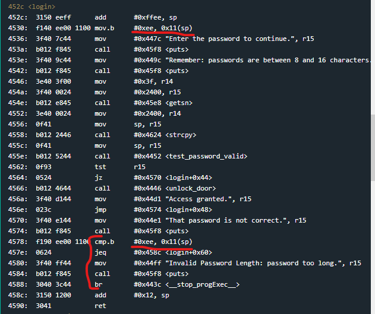
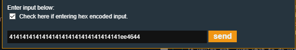

# Johannesburg

Johannesburg is the 8th challenge in the microcorruption series.
This lock is attached to the HSM-1, meaning the unlock function sits back with the lock again, and apparently an update was put in to prevent too long passwords.

Once again main() calls login() which calls a password testing function.
The login function looks mostly similiar with the exception of a byte 0xee which is moved into 0x11(sp).
Later that address is checked once again to make sure it still contains 0xee. If 0xee is not there anymore then print that the password length was invalid and exit.
The idea for this is that overly long passwords still exist, but this byte flag will be corrupted if the password is too long and then exit, which prevents the pop eip that happens at the ret.

The "flag" is set a sp + 0x11. 0x11 is decimal 17, so the flag is almost certainly set at the end of where the 16 character password buffer is.
This means I should be able to just tweak the previous overflow payloads and make sure the 17th byte is 0xee to bypass the password length restrictions..

I'll couple that by changing the return address to the start of the unlock_door() function at 0x4446 since the lock is using the HSM-1 now and has its own unlock function back in the code.

and yea, it worked.

