# Santa Cruz

Santa Cruz is the 9th challenge in the microcorruption series.
This challenge actually appears to have alot of changes compared to what all of the other challenges looked like.

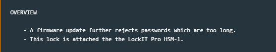

The change log doesnt reveal much, just that there is an update that further rejects long passwords and the lock is still attached to the HSM-1.

However, the code itself has changed quite a bit.

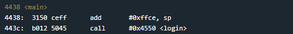

Main still just calls login, buuut

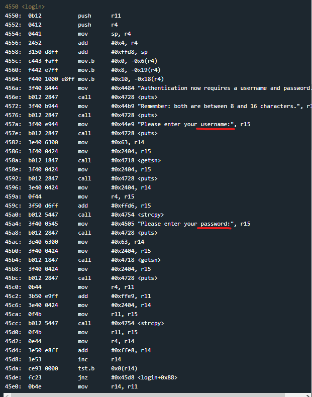

login() is now super long and contains extra thing like for the first time ever a username is required with the password.

There is also the usual confirm_password() style function but for now i'd like to get my head around what's going on in login.
So i'll run the program, enter an arbitrary username and password and start stepping through the bits I think are important.

I'm going to start by breaking at 0x45d2. The specific address is mostly arbitrary, but it comes after all of the puts/getsn/strcopy functions that I assume are the boring retrieval of the username and password from the user and is just before the first test+jump conditional logic in the function.

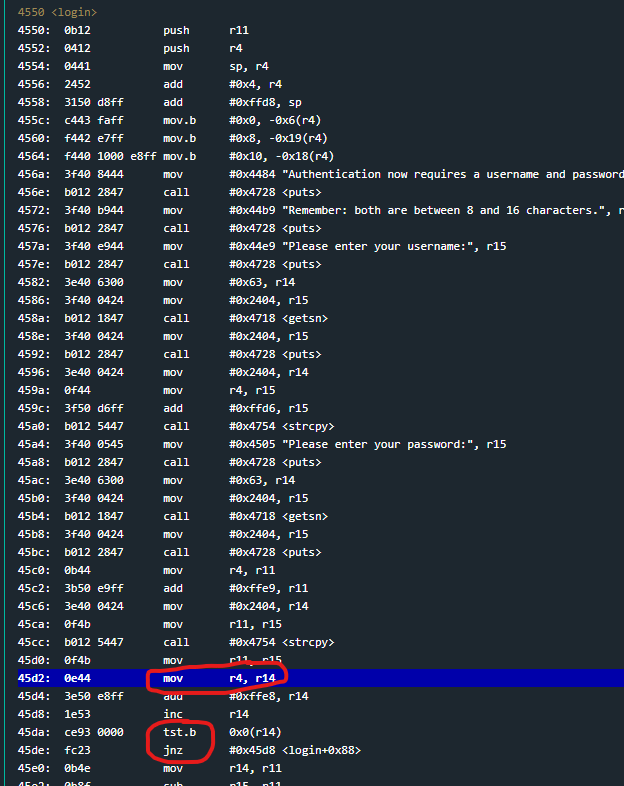

I'll enter a username of 16 A's and a passwords of 16 B's to help differentiate them in memory

Alright so stopping at the first breakpoint and stepping down to the tst.b instruction, I can see that it's testing the byte at r14+0x0 which is currently at the address 0x43b5.
0x43b5 points to the start of the password entered by the user, and jumps if its not zero back up to the inc r14 instruction just above.
This loop will set r14 to be equal to one byte past the end of the password. Which may or may not be relevant later.

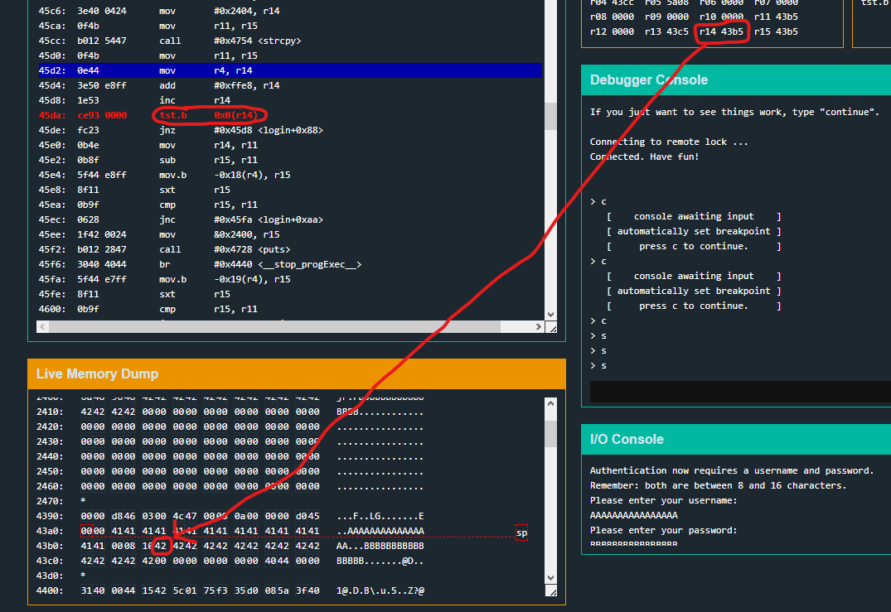

ok it's relevant.
The program then immediately uses that to get the password length and then compare it to a hardset value of 0x10 (16). killing the program if the password is too long.

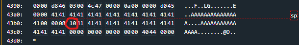

Interestingly, the hardcoded value for the password length sits inbetween the user inputted username and password.
So maybe I can use the username to overwrite that byte and set it to whatever length I want my password to be, allowing me to overwrite the return address once again.

We'll see.

I can see that before the 0x10 is 0x8, which is what the program declares to do the minimum password range aswell.

before I continue, I want to restart and confirm that this theory is possible.

I'll send in a username payload where those two bytes are modified to 01 and 99, hopefully allowing a very short and/or very long password.

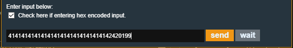

With that set i'll send an overly long password and just see if PC gets overwritten at the end of the login function.

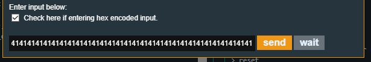

continuing on down the login function the checks for the password length pass, the HSM interrupt occurs and then right before the function ends, another check occurs to make sure the byte after the end of the password is 0x0. Which fails for my test.

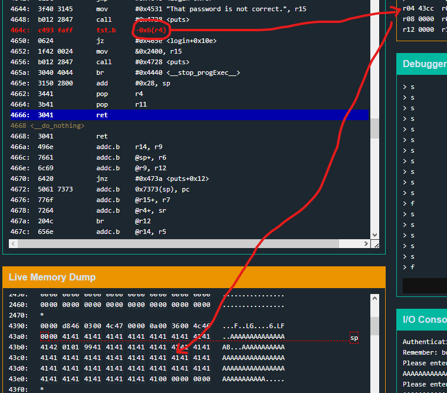

After smacking my head against this for a little bit I got an idea.
First let me sum up the problem:

- I am using the username field to overwrite the min/max password length bytes
- I am then using the password to attempt to overflow into the return address to control PC
- BUT I need a 00 to be right after the 16th byte of the password, which due to the strcopy, cuts the rest of the password payload off.

So to overcome that, my idea is this:

- use the username field to overwrite the min/max password length like normal, but then ALSO continue on into the password buffer and then beyond it
- once the username input has overwritten past the password field I can find and overwrite the return address
- I then use the password input to overwrite one byte past the end of the password buffer and restore the 0x00

The payloads will look like this

*username*
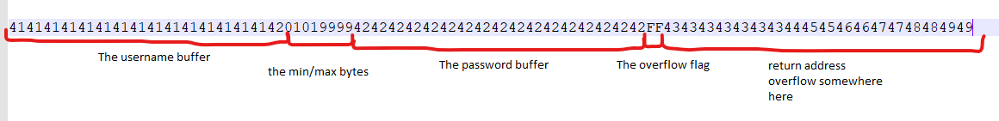

*password*
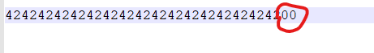

The password payload is purely just to reset the 0x00 byte to pass the overflow flag test.

Just in case I haven't explained myself properly, i'll take some screenshots of this idea in action.

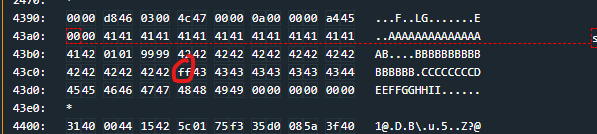

so this is the stack once the username has been strcopy'd onto the stack. I've highlighted the FF, which is the overflow flag byte.
The extra bytes (0x43) have been written past that flag, allowing the return address to be overwritten

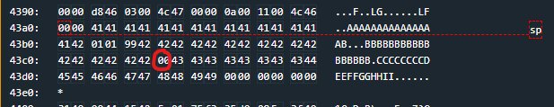

After the password payload is strcpy'd onto the stack, the 0x00 overflow flag is back and the last password check now passes, but the overflown bytes still exist!

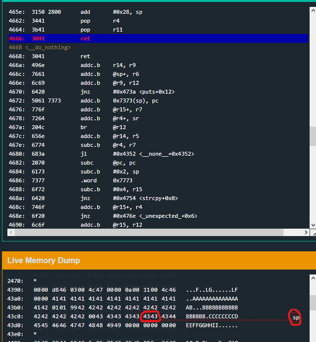

After breaking at the ret for the end of the login function I can see the exact bytes that overwrote the return address.
Now all thats left to do is plug in the address of the unlock function and solve

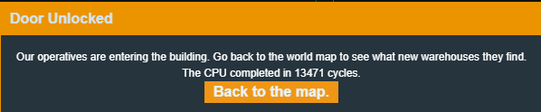